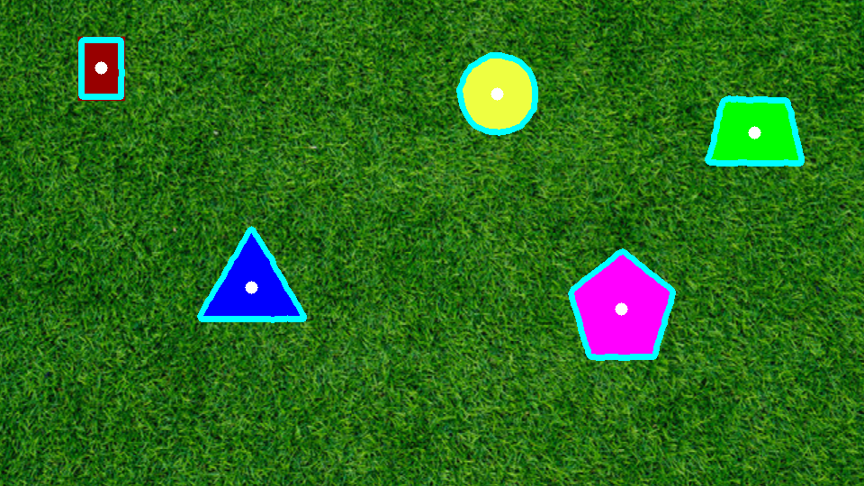
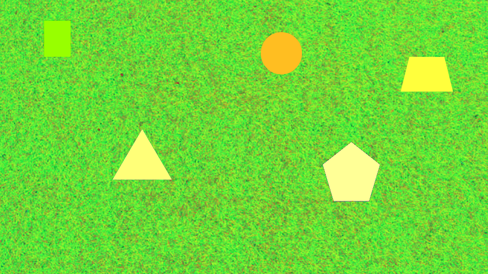
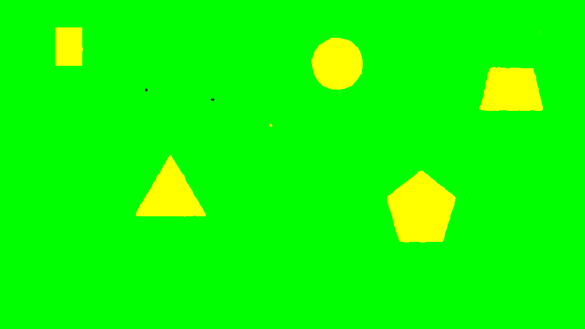
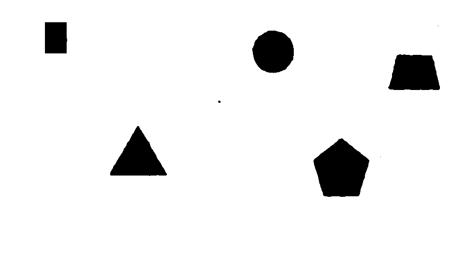
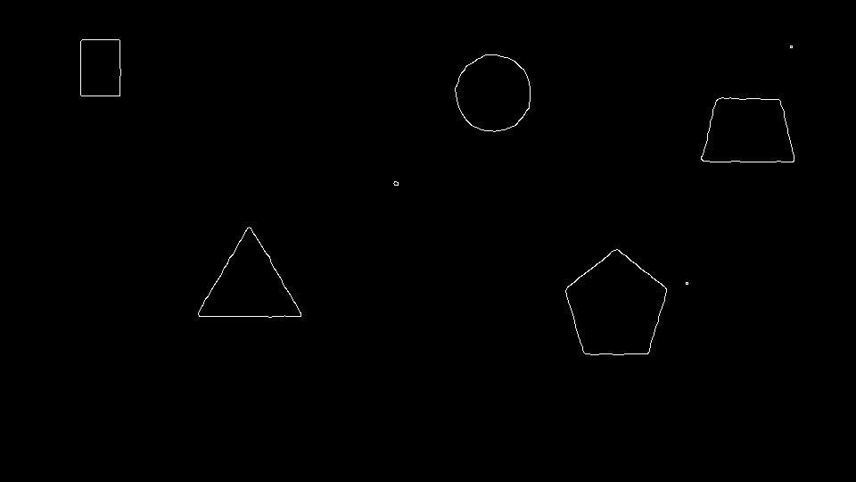

## PennAir Submission

### Running the Code
The project uses Python 3.9 on MacOS 15.6.1, but higher Python versions should work.
It uses the following libraries:
- numpy 2.0.2
- opencv-python 4.12.0.88

These can be installed through pip via:
`pip install numpy opencv-python`
> in some cases, pip3 might be required instead of pip

Development was done in **Intellij Idea** with the Python Plugin installed.

To get the output of the code, simply run the file. The output file will be in the corresponding resource folder at the root of the repo.

### Completed Images
**Challenge 1**:

**Challenge 2**:

**Challenge 3**:

**Performance on Challenge 3** (10 second video 300 frames):

### Processes
**Challenge 1**: I initially used a RGB to grayscale algorithm, before realizing some of the shapes were either too bright or too dark. Then, I pivoted to using HSV
1. Convert the image to HSV

2. Gaussian Blur to remove noise in the background
3. Threshold the image to be left with green and yellow

4. Filter for just yellow `RGB(255, 255, 0)`

5. Use Canny to isolate the shapes

6. Get contours and filter out the small noise or ones that are too large, finding the center and drawing a circle (dot) around it.

**Challenge 2**: The only real difference between 1 and 2 is the addition of a dilation and erosion (the former to remove small noise contours and the latter to revert the shapes back to their original size) and a `morphologyEx` to allow shapes in the video that come in contact to be able to trace around them. Also, I added a contour around the edge `copyMakeBorder` to be able to detect shapes that went out of bounds.

**Challenge 3**: In challenge 3, I also used the HSV algorithm, though with the threshold parameter changed. As a result, the ultimate code isn't background agnostic, though maybe the threshold parameter can be changed based on the video to allow it to be so.

### Completion
- [x] Challenge 1
- [x] Challenge 2
- [x] Challenge 3
- [ ] Challenge 4
- [ ] Challenge 5

#### Sources
- Contour center: https://pyimagesearch.com/2016/02/01/opencv-center-of-contour/
- Contour basics: https://www.geeksforgeeks.org/python/find-and-draw-contours-using-opencv-python/
- Shape detection with opencv: https://pyimagesearch.com/2016/02/08/opencv-shape-detection/
- Gaussian blur: https://hackaday.com/2021/07/21/what-exactly-is-a-gaussian-blur/
- Identifying contours: https://stackoverflow.com/questions/52737584/contour-identification-using-opencv
- Writing videos: https://opencv.org/blog/reading-and-writing-videos-using-opencv/

